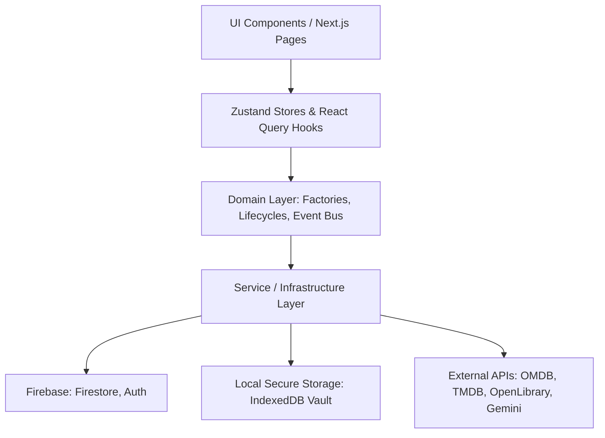

# Trackr (Archive V2)

A minimalist, premium personal memory, experience, and consumption tracking system (also known as the **Archive**). Trackr allows you to catalog your thoughts, media, and activities in a single workspace with an offline-first PWA architecture, automated metadata integrations, a Web Crypto-secured client-side credential vault, bi-directional knowledge graphs, and an AI intelligence layer powered by Gemini.

---

## 📖 User Guide: Cataloging Your Life

Trackr is designed to be low-friction, keyboard-accessible, and highly structured. Here is how you can get the most out of your personal Archive:

### 1. The Quick Add Console
Open the workspace command menu using `Cmd + K` (Mac) or `Ctrl + K` (Windows/Linux). 

* **Keyboard-Driven Input**: Capture new entries instantly.
* **Inline Hashtags**: Type `#tag` inside the input to auto-categorize. Pressing `Space` while typing a hashtag triggers autocomplete and creates the tag without breaking your typing flow.
* **Tag Normalization**: Common tags are automatically mapped to canonical representations (e.g. typing `#movies` or `#film` normalizes to `movie`, and `#shows` maps to `tv`).
* **Status Inference**: Adding status tags (e.g., `#watched`, `#read`, `#currentlyreading`, `#planto`) automatically transitions the resource lifecycle status to `completed`, `reading`, `watching`, `planned`, etc.
* **URL Auto-Detection**: Pasting a URL (e.g., `https://github.com/facebook/react`) automatically configures the item as a web link, sets the type (e.g., `github` or `website`), extracts a clean title (`github.com/facebook/react`), and appends the `#link` tag.

### 2. Dynamic & Ordered Collections
Group resources into custom collections to curate your archives:
* **Manual Collections**: Order lists via drag-and-drop or select specific resources.
* **Smart Dynamic Collections**: Define dynamic filtering rules (e.g., auto-group all items matching the tag `movie` or having a status of `planned`). Counts and cover images update automatically.

### 3. Wiki-Style Notes & Interlinking
Create rich, formatted thoughts about your resources:
* **Markdown Support**: Write notes using a built-in markdown editor.
* **Double-Bracket Wiki-Links**: Interconnect resources together. Type `[[Resource Title]]` inside a note to create an internal hyperlink, allowing you to build your own personal wiki/knowledge vault.

### 4. Knowledge Graph Relationships
Model complex connections between items using a bi-directional relationship mapper. Define connections such as:
* `adaptation_of` (e.g., a movie adapted from a book)
* `sequel_to` / `prequel_to` (e.g., film series ordering)
* `repository_for` / `article_for`
* `related_to`
Browse and navigate these links in a dynamic Graph view directly on the resource details page.

### 5. AI Intelligence Popover (Gemini)
Access smart utilities via the AI Actions header button:
* **On-Demand Auto-Tagging**: Generates contextually relevant tags based on your notes and title, prioritizing reuse of your existing tag taxonomy.
* **Similarity Analysis**: Evaluates your library to discover and display high-confidence semantic matches.
* **Natural Language Query**: Ask questions about your archive (e.g., *"What books did I read last year that were about history?"*) to receive intelligent answers and instant filter suggestions.
* **Smart Cleanups & Duplicates**: Automate tag and metadata deduplication and identify duplicate resource candidates.

### 6. PWA & Offline Support
* **Installable App**: Save Trackr to your phone or desktop home screen.
* **Offline-First Persistence**: Read, write, and edit your archive without an internet connection. Firestore changes cache locally and synchronize via a background sync queue once network connectivity returns.
* **Status Indicator**: Check real-time network and syncing states directly from the sidebar.

### 7. Data Portability & Backups
Keep ownership of your data. Under settings, export your entire library (resources, collections, notes, relationships, and activity logs) into a single standard JSON backup file. Import it back anytime; Trackr handles schema validation, tag normalization, and ID collisions.

---

## 🛠️ Developer Guide: Architecture & Setup

Trackr V2 uses a modern React stack on top of a highly decoupled domain architecture.

### 1. Architecture Overview



* **Modular Provider Platform**: Integrations are managed under `src/providers/` and `src/services/providers/`. Supported metadata engines include:
  - **TMDB & OMDB** (Movies & TV Shows)
  - **Google Books & OpenLibrary** (Books)
  - **Gemini** (AI actions)
* **V2 Lazy Firestore Migration**: When upgrading from legacy `items` schema to the `resources` collection:
  1. The app checks if a migration flag is absent in `localStorage` and `resources` is empty.
  2. Concurrently pulls legacy records from `users/{uid}/items`.
  3. Maps legacy attributes to the `Resource` V2 schema, batch-writes to `users/{uid}/resources`, and flags migration as complete.
* **Client-Side Secure Credential Vault**: Integrations require API keys (e.g., OMDB key, Gemini key). To preserve privacy, keys are stored encrypted client-side:
  - Encryption uses **AES-GCM 256-bit** via the Web Crypto API.
  - Plaintext keys reside only in transient session memory with a 15-minute inactivity timeout.
  - Encryption records are stored in IndexedDB (`trackr_secure_vault`) alongside a **SHA-256 fingerprint hash** used to check key integrity on decryption.
  - Master keys are derived from device credentials.
* **Event-Driven Auditing**: A lightweight, client-side event bus (`src/domain/events/event-bus.ts`) publishes operations (like credential updates or metadata refreshes) to keep activity streams and audit logs in sync.

---

### 2. Getting Started & Installation

#### Prerequisites
* [Node.js](https://nodejs.org/) (v18.x or v20.x recommended)
* A [Firebase Project](https://console.firebase.google.com/) configured with:
  * Firestore Database (Rules located in `firestore.rules`)
  * Firebase Authentication (Email/Password or Anonymous)

#### Local Setup

1. **Clone the Repository & Install Dependencies**:
   ```bash
   npm install
   ```

2. **Configure Environment Variables**:
   Create a `.env` file in the root workspace. Define your web client credentials:
   ```env
   NEXT_PUBLIC_API_KEY=your_firebase_api_key
   NEXT_PUBLIC_AUTH_DOMAIN=your_firebase_auth_domain
   NEXT_PUBLIC_PROJECT_ID=your_firebase_project_id
   NEXT_PUBLIC_STORAGE_BUCKET=your_firebase_storage_bucket
   NEXT_PUBLIC_MESSAGING_SENDER_ID=your_firebase_messaging_sender_id
   NEXT_PUBLIC_APP_ID=your_firebase_app_id
   ```
   *Note: Integration API keys (Gemini, OMDB, TMDB) are NOT placed in `.env`. They are securely configured via the Settings panel in the running web application.*

3. **Run the Development Server**:
   ```bash
   npm run dev
   ```
   Open [http://localhost:3000](http://localhost:3000) to view the application locally.

4. **Production Build & Linting**:
   ```bash
   # Validate types and build optimized bundle
   npm run build
   
   # Run ESLint validation rules
   npm run lint
   ```

#### 🌐 Vercel & Production Auth Deployment Checklist
When deploying to Vercel or a custom domain, ensure:
1. **Firebase Authorized Domains**: Add your production domain in **Firebase Console → Authentication → Settings → Authorized Domains**:
   - `your-app.vercel.app`
   - `your-custom-domain.com`
2. **Environment Variables**: Add all `NEXT_PUBLIC_*` environment variables (especially `NEXT_PUBLIC_AUTH_DOMAIN`) to your Vercel Project Environment Settings.
3. **Popup Blockers**: The app executes `signInWithPopup` synchronously upon user interaction and automatically falls back to `signInWithRedirect` if popup blockers intercept the window.

---

### 3. Running Unit Tests

Trackr uses self-contained unit test scripts to validate core utilities, crypto components, and domain business rules without external mock dependency bloat.

To run all unit tests in the workspace:
```bash
find src -name "*.test.ts" -exec npx -y tsx {} \;
```

#### Monitored Test Modules
* **Secure Crypto & Encryption** (`src/lib/__tests__/secure-crypto-v2.test.ts`): Checks AES-GCM encryption/decryption, fingerprint hashing, and legacy V1 decryption compatibility.
* **Tag Normalization & Formatting** (`src/lib/__tests__/tag-normalization-link.test.ts`): Tests rules mapping singular/plural categories and status extraction logic.
* **Smart Collection Rules** (`src/services/__tests__/collection-service.test.ts`): Confirms collection builders successfully execute dynamic checks.
* **Knowledge Graph Relations** (`src/services/__tests__/relationship-service.test.ts`): Validates bi-directional relationship mappings and cycle-prevention.
* **Metadata Mapping & Preservations** (`src/lib/__tests__/metadata-mapping.test.ts`): Ensures manual changes (like user notes/custom titles) are never overridden by external provider refreshes.
